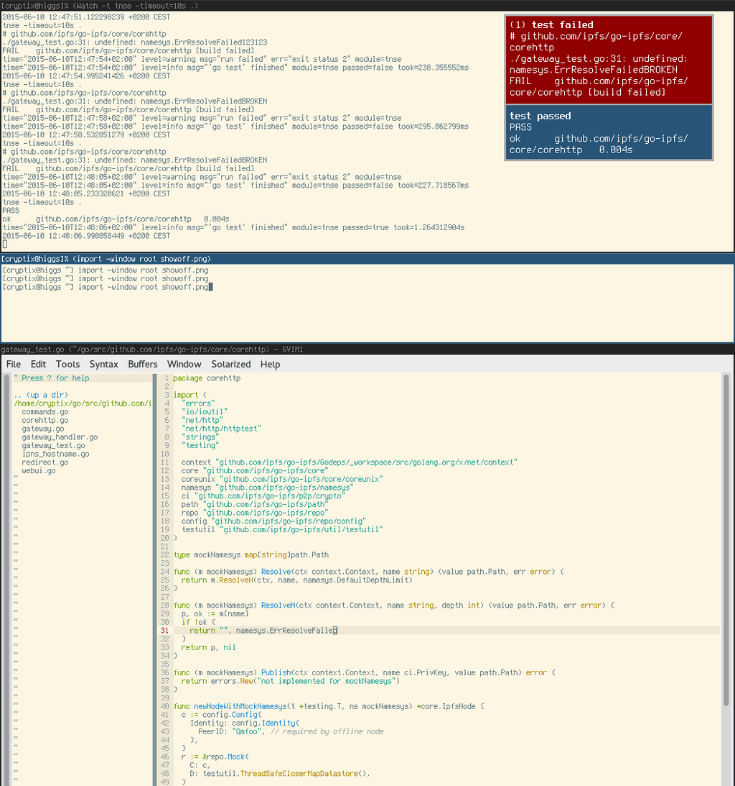
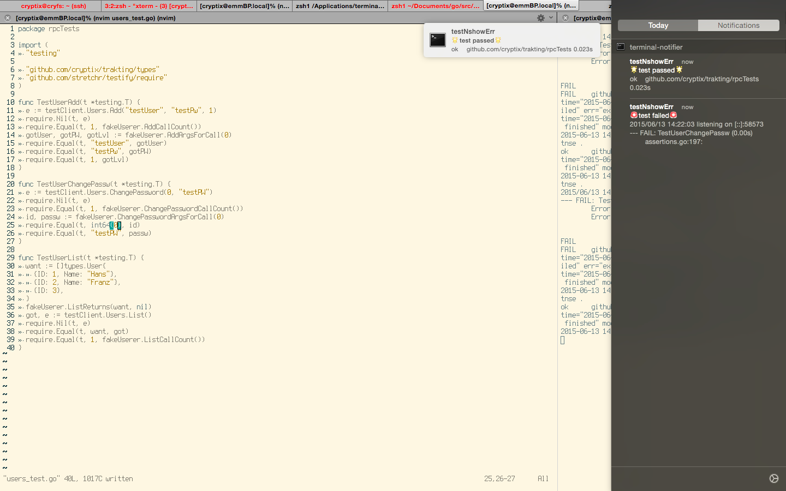

# TNSE - Test aNd Show Error

Usage: `tnse <package>`

Runs `go test <package>` and displays errors in desktop notification systems.

## Linux
Uses gnome `notify-send` from libnotify.

* screenshot uses [dunst](http://www.knopwob.org/dunst/) for showing them

## OSX
Uses [terminal-notifier](https://github.com/alloy/terminal-notifier).

### other resources

* [Watch](https://github.com/eaburns/Watch) to re-run on fs changes
